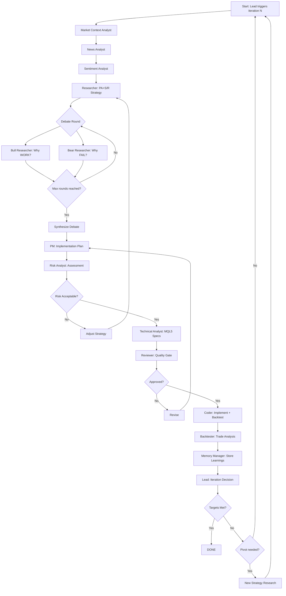

# Kế Hoạch Tích Hợp TradingAgents vào EA-OAT-v2

## Tổng Quan

Tích hợp ý tưởng multi-agent từ TradingAgents (Python/LangGraph) vào hệ thống EA-OAT-v2 (MT5/MQL5) để tăng cường khả năng phân tích và ra quyết định trading.

---

## So Sánh Hai Hệ Thống

### TradingAgents (Stock Trading)
**Mục tiêu:** Trading cổ phiếu dựa trên fundamental + technical + sentiment + news
**Công nghệ:** Python, LangGraph, LLM agents (GPT-5, Gemini, Claude)
**Pipeline:**
```
Analyst Team → Researcher Debate → Trader Decision → Risk Management → Portfolio Manager
```

**Agents:**
1. **Fundamentals Analyst** - Phân tích báo cáo tài chính
2. **Market Analyst** - Technical indicators (SMA, MACD, RSI, Bollinger)
3. **Sentiment Analyst** - Social media sentiment
4. **News Analyst** - World news impact
5. **Bull Researcher** - Tranh luận quan điểm tích cực
6. **Bear Researcher** - Tranh luận quan điểm tiêu cực
7. **Trader** - Đưa ra quyết định BUY/SELL/HOLD
8. **Risk Management** - Đánh giá rủi ro (conservative/aggressive/neutral debators)
9. **Portfolio Manager** - Phê duyệt cuối cùng

### EA-OAT-v2 (MT5 EA Development)
**Mục tiêu:** Phát triển EA cho Gold/Oil dựa trên Price Action + S/R
**Công nghệ:** MQL5, MT5, Claude Code Agent Teams
**Pipeline:**
```
Researcher → PM → Technical Analyst → Reviewer → Coder → Backtester → Lead
```

**Agents:**
1. **Researcher** - Research PA + S/R methods
2. **PM** - Strategy breakdown to implementation plan
3. **Technical Analyst** - Convert plan to MQL5 specs
4. **Reviewer** - Quality gate
5. **Coder** - Implement + compile + backtest
6. **Backtester** - Trade-by-trade analysis
7. **Em (Lead)** - Coordination + iteration decisions

---

## Điểm Mạnh Cần Học Từ TradingAgents

### 1. **Multi-Perspective Analysis (Bull vs Bear Debate)**
- TradingAgents có cơ chế tranh luận giữa Bull/Bear researchers
- Giúp tránh confirmation bias, xem xét đa chiều trước khi quyết định
- **Áp dụng:** Thêm "Bull/Bear Debate" phase vào EA-OAT-v2

### 2. **Memory System**
- TradingAgents dùng memory để học từ quyết định trong quá khứ
- Tránh lặp lại sai lầm, cải thiện theo thời gian
- **Áp dụng:** Tăng cường `experience/` và `brain/` với semantic search

### 3. **Multi-Source Data Integration**
- Fundamentals, Technical, Sentiment, News - phân tích đa nguồn
- **Áp dụng:** Thêm data sources cho Gold/Oil (DXY correlation, news events, volume profile)

### 4. **Risk Management Layer**
- Conservative/Aggressive/Neutral debators đánh giá risk trước execution
- **Áp dụng:** Thêm Risk Analyst agent review strategy trước khi code

### 5. **LangGraph Flow Control**
- Conditional routing, reflection loops, state management rõ ràng
- **Áp dụng:** Formalize workflow với state machine cho EA-OAT-v2

---

## Kiến Trúc Mới: EA-OAT-v2 Enhanced

### Phase 1: Research & Analysis (TradingAgents-inspired)
```
                    ┌─────────────────────┐
                    │   Market Context    │
                    │   Analyst (NEW)     │
                    │  - HTF trend        │
                    │  - DXY correlation  │
                    │  - Volume profile   │
                    └──────────┬──────────┘
                               │
                    ┌──────────▼──────────┐
                    │   News Analyst      │
                    │      (NEW)          │
                    │  - FOMC, NFP, CPI   │
                    │  - Geopolitical     │
                    └──────────┬──────────┘
                               │
            ┌──────────────────┴────────────────┐
            │                                   │
    ┌───────▼────────┐              ┌──────────▼─────────┐
    │   Researcher   │              │  Sentiment Analyst │
    │   (Enhanced)   │              │      (NEW)         │
    │  PA + S/R      │              │  - COT reports     │
    │  + SMC/ICT     │              │  - Trader sentiment│
    └───────┬────────┘              └──────────┬─────────┘
            └──────────────────┬────────────────┘
                               │
                    ┌──────────▼──────────┐
                    │   Strategy Debate   │
                    │      (NEW)          │
                    │ Bull vs Bear        │
                    │ Researcher Agents   │
                    └──────────┬──────────┘
                               │
                    ┌──────────▼──────────┐
                    │   PM (Enhanced)     │
                    │ + Risk Assessment   │
                    └──────────┬──────────┘
                               │
                         [Existing Pipeline]
```

### Phase 2: Quality Gate (Existing + Enhanced)
```
Technical Analyst → Reviewer → Risk Analyst (NEW) → Approve/Reject
```

### Phase 3: Implementation & Testing (Existing)
```
Coder → Backtester → Em (Lead)
```

---

## Agents Mới Cần Tạo

### 1. Market Context Analyst
**Vai trò:** Phân tích bối cảnh thị trường tổng thể
**Input:** Gold/Oil price data, DXY, correlations
**Output:** Market regime report (trending/ranging, volatility level, correlation strength)
**Tools:**
- Multi-timeframe analysis (M15, H1, H4, D1)
- DXY correlation calculator
- ATR volatility assessment
- Session volume analysis

**File:** `skills/market-context-analyst/SKILL.md`

---

### 2. News & Events Analyst
**Vai trò:** Theo dõi news events tác động đến Gold/Oil
**Input:** Economic calendar, news feeds
**Output:** Event impact assessment + session filters
**Tools:**
- Economic calendar scraper
- News sentiment analyzer
- Session risk assessment (avoid trading during high-impact news)

**File:** `skills/news-analyst/SKILL.md`

---

### 3. Sentiment Analyst
**Vai trò:** Đo lường market sentiment cho Gold/Oil
**Input:** COT reports, broker sentiment, futures positioning
**Output:** Sentiment bias report (bullish/bearish/neutral)
**Tools:**
- COT report parser
- Commitment of Traders analysis
- Retail vs institutional positioning

**File:** `skills/sentiment-analyst/SKILL.md`

---

### 4. Bull Strategy Researcher
**Vai trò:** Tranh luận quan điểm BULLISH cho strategy
**Input:** Researcher's proposed strategy + Market context
**Output:** Bull case - tại sao strategy sẽ WORK
**Debate with:** Bear Strategy Researcher

**File:** `skills/bull-researcher/SKILL.md`

---

### 5. Bear Strategy Researcher
**Vai trò:** Tranh luận quan điểm BEARISH - tìm lỗ hổng
**Input:** Researcher's proposed strategy + Market context
**Output:** Bear case - rủi ro, edge cases, tại sao có thể FAIL
**Debate with:** Bull Strategy Researcher

**File:** `skills/bear-researcher/SKILL.md`

---

### 6. Risk Analyst
**Vai trò:** Đánh giá risk trước khi code
**Input:** PM's implementation plan + Debate results
**Output:** Risk assessment report + recommendations
**Checkpoints:**
- Max drawdown projection
- Win rate feasibility
- Risk:Reward sustainability
- Market regime compatibility

**File:** `skills/risk-analyst/SKILL.md`

---

### 7. Memory Manager (Enhancement)
**Vai trò:** Quản lý experience/brain với semantic search
**Tools:**
- Embedding-based memory retrieval
- Pattern matching from past iterations
- Lesson learned aggregation

**File:** `skills/memory-manager/SKILL.md`

---

## Tools/Utilities Cần Xây Dựng

### 1. Market Data Integrator
**Purpose:** Thu thập data từ nhiều nguồn cho Gold/Oil
**Sources:**
- MT5 history data (OHLCV)
- DXY (Dollar Index) correlation data
- COT reports
- Economic calendar
- News feeds (filtered for Gold/Oil)

**Location:** `code/utils/market_data_integrator.py` (Python)
**Integration:** Coder reads from shared JSON/CSV files

---

### 2. Correlation Analyzer
**Purpose:** Tính correlation giữa Gold, Oil, DXY, Yields
**Output:** Correlation matrix, strength levels, regime detection
**Location:** `code/utils/correlation_analyzer.py`

---

### 3. Multi-Timeframe Analyzer
**Purpose:** HTF trend + LTF entry signals
**Timeframes:** M15 (entry), H1 (signal), H4 (trend), D1 (bias)
**Output:** Confluence report
**Location:** `code/utils/mtf_analyzer.mq5` (MQL5 library)

---

### 4. Debate Orchestrator
**Purpose:** Quản lý Bull vs Bear debate rounds
**Flow:**
1. Bull presents case
2. Bear counters with risks
3. Bull refutes
4. Repeat N rounds (config: max_debate_rounds)
5. Synthesize conclusion

**Location:** `code/utils/debate_orchestrator.py`

---

### 5. Memory Search Engine
**Purpose:** Semantic search trong brain/ và experience/
**Features:**
- Embedding-based similarity search
- Context retrieval from past iterations
- Lesson aggregation

**Location:** `code/utils/memory_search.py`
**Storage:** SQLite/ChromaDB for embeddings

---

## Pipeline Workflow Mới

### Iteration Workflow (Enhanced)



---

## Cấu Trúc Thư Mục Mới

```
EA-OAT-v2/
├── brain/                          (existing - enhanced)
│   ├── strategy_research.md
│   ├── market_context_reports/     (NEW)
│   ├── news_impact_log.md          (NEW)
│   ├── sentiment_reports/          (NEW)
│   ├── debate_transcripts/         (NEW - lưu Bull vs Bear debates)
│   ├── risk_assessments/           (NEW)
│   └── memory_index.db             (NEW - semantic search DB)
│
├── skills/                         (enhanced)
│   ├── em-manager/                 (existing)
│   ├── researcher/                 (existing - enhanced)
│   ├── pm/                         (existing - enhanced)
│   ├── technical-analyst/          (existing)
│   ├── reviewer/                   (existing)
│   ├── coder-worker/               (existing)
│   ├── backtester/                 (existing)
│   ├── market-context-analyst/     (NEW)
│   ├── news-analyst/               (NEW)
│   ├── sentiment-analyst/          (NEW)
│   ├── bull-researcher/            (NEW)
│   ├── bear-researcher/            (NEW)
│   ├── risk-analyst/               (NEW)
│   └── memory-manager/             (NEW)
│
├── code/
│   ├── experts/                    (existing)
│   ├── include/                    (existing)
│   ├── indicators/                 (existing)
│   └── utils/                      (NEW)
│       ├── market_data_integrator.py
│       ├── correlation_analyzer.py
│       ├── debate_orchestrator.py
│       ├── memory_search.py
│       └── mtf_analyzer.mqh        (MQL5 library)
│
├── data/                           (NEW)
│   ├── market_context/             (DXY, correlations, volume)
│   ├── news_events/                (economic calendar, news)
│   ├── sentiment/                  (COT reports, positioning)
│   └── embeddings/                 (memory search vectors)
│
└── config/
    └── agents_config.yaml          (NEW - agent settings, debate rounds, etc.)
```

---

## Cấu Hình Agents (agents_config.yaml)

```yaml
# Agent Configuration for EA-OAT-v2 Enhanced

llm_provider: "anthropic"  # openai, anthropic, google
deep_think_model: "claude-opus-4-6"     # for complex analysis
quick_think_model: "claude-sonnet-4-5"  # for quick tasks

# Debate Configuration
debate:
  max_rounds: 2
  bull_researcher: "claude-sonnet-4-5"
  bear_researcher: "claude-sonnet-4-5"
  synthesis_model: "claude-opus-4-6"

# Risk Management
risk:
  max_acceptable_dd: 10  # percent
  min_win_rate: 90       # percent
  min_risk_reward: 2.0   # ratio
  min_trades_per_day: 10

# Memory System
memory:
  enabled: true
  retrieval_count: 3     # top N similar memories
  embedding_model: "text-embedding-3-small"
  storage: "chromadb"

# Market Data Sources
data_sources:
  gold_symbol: "XAUUSD"
  oil_symbol: "CL"
  dxy_enabled: true
  cot_reports_enabled: true
  news_feeds_enabled: true

# Agent Permissions
agents:
  market_context_analyst:
    enabled: true
    model: "claude-sonnet-4-5"

  news_analyst:
    enabled: true
    model: "claude-sonnet-4-5"

  sentiment_analyst:
    enabled: true
    model: "claude-sonnet-4-5"

  bull_researcher:
    enabled: true
    model: "claude-sonnet-4-5"

  bear_researcher:
    enabled: true
    model: "claude-sonnet-4-5"

  risk_analyst:
    enabled: true
    model: "claude-opus-4-6"  # use opus for critical risk decisions

  memory_manager:
    enabled: true
    model: "claude-haiku-4-5"
```

---

## Roadmap Triển Khai

### Phase 1: Foundation (Week 1-2)
- [ ] Tạo 7 skill files mới (Market Context, News, Sentiment, Bull, Bear, Risk, Memory)
- [ ] Setup agents_config.yaml
- [ ] Tạo data/ directory structure
- [ ] Implement market_data_integrator.py (basic)

### Phase 2: Data Integration (Week 2-3)
- [ ] Integrate DXY correlation data
- [ ] Setup economic calendar scraper
- [ ] Implement COT report parser
- [ ] Build correlation_analyzer.py

### Phase 3: Debate System (Week 3-4)
- [ ] Implement debate_orchestrator.py
- [ ] Test Bull vs Bear debate on Iteration 0 strategy
- [ ] Refine debate prompts
- [ ] Add debate transcript logging

### Phase 4: Memory System (Week 4-5)
- [ ] Setup ChromaDB/SQLite for embeddings
- [ ] Implement memory_search.py
- [ ] Migrate existing brain/ to searchable format
- [ ] Test memory retrieval in Researcher agent

### Phase 5: Risk Analysis (Week 5-6)
- [ ] Implement Risk Analyst agent
- [ ] Create risk assessment templates
- [ ] Integrate risk gate into pipeline
- [ ] Test with real backtest data

### Phase 6: Integration Testing (Week 6-7)
- [ ] Run full pipeline with all new agents on Iteration 1
- [ ] Compare results: old vs enhanced pipeline
- [ ] Measure improvement in WR, RR, trades/day
- [ ] Iterate and refine

### Phase 7: Production (Week 8)
- [ ] Document new workflow in README
- [ ] Update slash commands for new agents
- [ ] Create quick-start guide
- [ ] Deploy and monitor

---

## Metrics Đo Lường Hiệu Quả

### Pipeline Performance
- **Debate Quality:** % of strategies passing Bear challenge
- **Risk Prediction Accuracy:** Actual DD vs Projected DD
- **Memory Recall:** % of relevant past lessons retrieved
- **Iteration Efficiency:** Iterations to reach targets (old vs new)

### Trading Performance (same targets)
- Win Rate >= 90%
- Risk:Reward >= 1:2
- Trades/day >= 10
- Max Drawdown < 10%

### Time Savings
- Time to first viable strategy (iteration count)
- False signal reduction from debate process
- Debugging time saved by risk pre-screening

---

## Risks & Mitigations

### Risk 1: Complexity Overhead
**Concern:** Too many agents slow down iteration cycle
**Mitigation:**
- Make agents toggleable via config
- Start with debate + risk only
- Gradually add more agents

### Risk 2: LLM Cost
**Concern:** Multi-agent system = nhiều API calls
**Mitigation:**
- Use Haiku for quick tasks
- Use Opus only for critical decisions (risk, synthesis)
- Cache/reuse context where possible

### Risk 3: Conflicting Recommendations
**Concern:** Bull vs Bear debate không kết luận rõ ràng
**Mitigation:**
- Clear synthesis prompt
- Weighted scoring system
- Lead has final decision power

### Risk 4: Data Quality
**Concern:** DXY, COT data không accurate/timely
**Mitigation:**
- Multiple data sources
- Data validation checks
- Fallback to pure PA+S/R if data missing

---

## Next Steps

1. **Review & Approve:** Boss review kế hoạch này
2. **Create Agents:** Tạo 7 skill files mới
3. **Setup Config:** agents_config.yaml + data structure
4. **Test Debate:** Run Bull vs Bear on SimpleEA strategy
5. **Iterate:** Refine based on results

---

## Appendix: Example Debate Transcript

### Iteration 0 Strategy: SimpleEA (MA Crossover at S/R)

**Bull Researcher:**
```
This MA crossover at S/R strategy has strong merit:

1. CONFLUENCE: We're combining TWO proven concepts - MA trend + S/R levels.
   Not just one signal, but multi-factor confirmation.

2. GOLD BEHAVIOR: Gold respects round numbers and psychological levels.
   The S/R buffer (10 points) accounts for noise and false breaks.

3. WIN RATE POTENTIAL: By requiring BOTH MA crossover AND S/R touch,
   we filter out 80% of false signals. Only high-probability setups trade.

4. SIMPLICITY: Clean rules = easy to backtest, debug, optimize.
   Not a black box.

Expected: WR 85%+, RR 1:2, 15 trades/day on H1
```

**Bear Researcher:**
```
I see critical flaws that will MISS targets:

1. LAGGING PROBLEM: MA crossover is LATE by definition. By the time
   fast MA crosses slow MA, price already moved 20-30 pips. We enter
   AFTER the move starts. This kills RR - SL too wide, TP too tight.

2. WHIPSAW RISK: Gold ranging 60% of the time in Asian session.
   MA crossover will flip-flop = consecutive losses. No session filter
   = trading when we shouldn't.

3. S/R IDENTIFICATION: How do we DEFINE S/R levels? Code just uses
   last swing high/low. What if there are MULTIPLE levels? What if
   price is between levels? Ambiguous = inconsistent signals.

4. FALSE BREAKOUTS: Gold LOVES liquidity sweeps - fake breakout above
   resistance, then reverses. Our 10-point buffer won't save us.

Projection: WR 65%, RR 1:1.5, 8 trades/day. MISS ALL targets.
```

**Synthesis (Lead):**
```
Bear has valid points. Bull is overly optimistic.

DECISION: Code SimpleEA v1 as baseline, BUT add:
- Session filter (London + NY overlap only)
- Better S/R: use previous day high/low + round numbers
- Confirmation candle: wait for bar close, not touch

Expected realistic: WR 75%, RR 1:1.8, 12 trades/day
This gives us BASELINE. Iteration 1 will address remaining gaps.
```

---

**Kết Luận:** Debate giúp tránh oversights, set realistic expectations, plan cho iterations tiếp theo.
